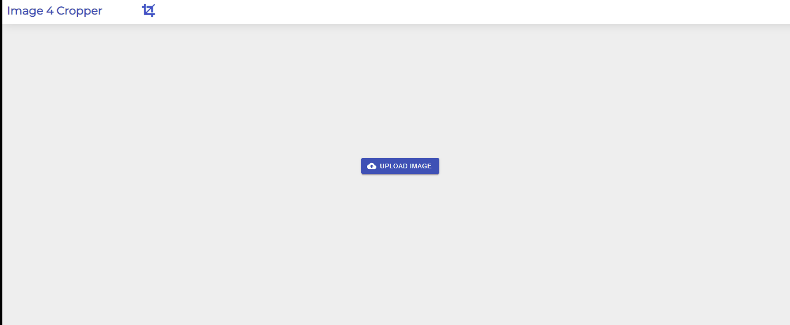

# Image 4 Cropper

## Download/View

You can view the live website [here](http://Gauthamjm007.github.io/image_cropper)  
or you can run it in local server  
git clone https://github.com/Gauthamjm007/image_cropper.git
cd image-cropper 
npm install  
npm run  

### Description

A web page where the user can upload an image 
Each image has to be exactly 1024 x 1024. 
If the image is not in the right format it wont be uploaded 
Each image is converted into four different sizes. 
display all four of these new images after upload to cloud. 
Preview the files before upload and decide how you want crop 
Uploaded to github pages and can be viewed from there 

### Packages used

@material-ui/core 
@material-ui/icons 
@material-ui/lab 
react-image-crop 
react-responsive-carousel 
sweetalert2 

##### How to upload and the Preview

##### Only Images of format 1024X1024

